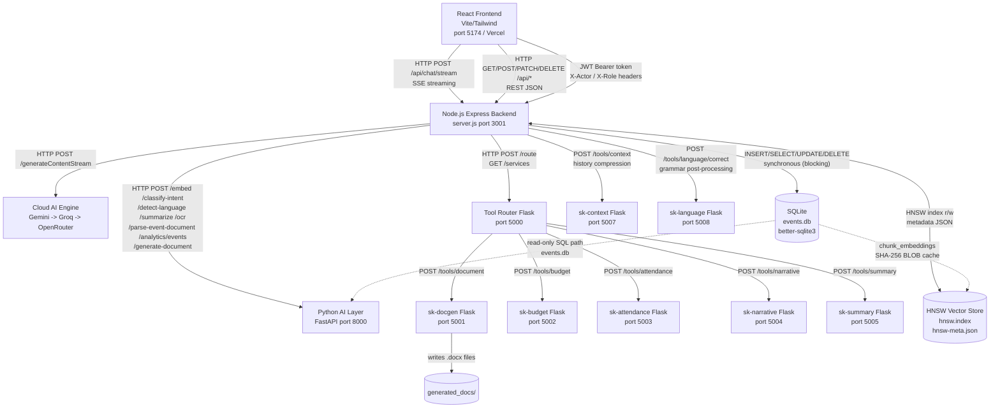
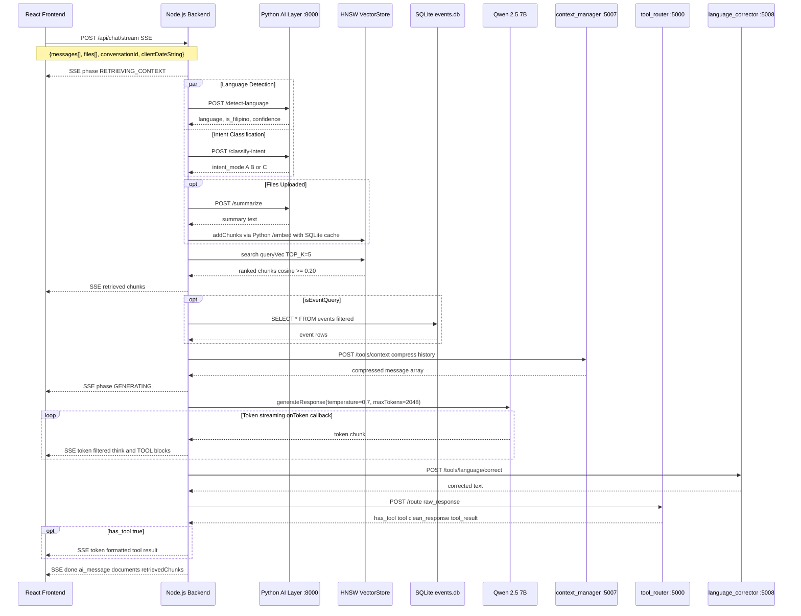

# aSK//YOUTH AI — System Architecture Context Document

> **Purpose:** Definitive source-of-truth for AI models and developers who need to understand this system without direct repository access. Generated via automated deep scan on 2026-08-24.

---

# 1. Executive Summary

## Project Name
**aSK//YOUTH AI** — *An AI-Driven SK Management and Public Service System*

## Primary Purpose & Target Problem Solved

aSK//YOUTH AI is a full-stack, locally-hosted AI assistant and management platform built for the **Sangguniang Kabataan (SK) of Barangay Concepcion Dos, Marikina City, Philippines**. The SK is the youth governance body of the Philippine barangay system.

The system solves five core problems faced by youth local government units:

1. **Information Silos** — SK officials and youth constituents had no unified source of truth for events, programs, budgets, and governance documents.
2. **Document Drafting Burden** — Creating official SK documents (resolutions, certificates, meeting minutes) was manual and error-prone.
3. **Accessibility Gap** — Youth constituents had no easy channel to query SK information, submit suggestions, or interact with local governance.
4. **Attendance Tracking** — Paper-based event attendance logs were inefficient and prone to data loss.
5. **Language Barrier** — AI systems defaulted to English; this system understands and responds in Filipino/Tagalog.

## High-Level Workflow

```
User (Youth / SK Officer / Admin)
        │
        ▼
  React Frontend (Vite + TailwindCSS v4)
  [Chat UI | Events Dashboard | Admin Panel | QR Scanner]
        │  HTTP / SSE (Streaming)
        ▼
  Node.js Express Backend (port 3001) — JWT Auth
  [Fused RAG + SQL Context Builder]
        │                   │ SQLite (events.db)
        │                   ▼
        │         SQLite DB (better-sqlite3)
        │         [events, users, suggestions, system_logs, event_logs, chunk_embeddings]
        │  VRAM (CUDA/Vulkan)
        ▼
  Cloud AI Fallback Engine
  [Tier 1: Gemini -> Tier 2: Groq -> Tier 3: OpenRouter]
        │  HTTP (internal)
        ▼
  Python AI Layer (FastAPI, port 8000)
  [Intent Classification | Language Detection | Summarization | Embeddings | OCR | Analytics]
        │  HTTP (tool routing)
        ▼
  Python Tool Microservices (Flask, ports 5000–5008)
  [sk-router | sk-docgen | sk-budget | sk-attendance | sk-narrative | sk-summary | sk-context | sk-language]
        │
        ▼
  Cloudflare Tunnel → api.askyouth.online (production)
  Vercel → askyouth.online (frontend hosting)
```

---

# 2. Technology Stack & Dependencies

## Languages

| Language | Role |
|---|---|
| JavaScript (ESM) — Node.js LTS | Backend server, LLM orchestration |
| JavaScript JSX/React — ES2022+ | Frontend SPA |
| Python 3.10+ | AI layer (FastAPI), tool microservices (Flask) |
| SQL — SQLite dialect | Database queries |

## Frontend Libraries

| Library | Version | Purpose |
|---|---|---|
| React | ^18.2.0 | SPA UI framework |
| Vite | ^5.2.0 | Build tool and dev server (port 5174) |
| TailwindCSS | ^4.2.2 | Utility-first CSS (via @tailwindcss/vite plugin) |
| react-markdown | ^10.1.0 | Renders AI markdown responses in chat |
| react-plotly.js | ^2.6.0 | Interactive analytics charts |
| plotly.js | ^3.5.0 | Charting engine (peer dependency) |
| axios | ^1.6.8 | HTTP client for API calls |
| jsqr | ^1.4.0 | QR code decoding from camera frames (pure JS) |

## Backend Libraries

| Library | Version | Purpose |
|---|---|---|
| Express | ^4.19.2 | HTTP server and routing |
| @google/generative-ai | ^0.2.1 | Gemini SDK for primary LLM |
| groq-sdk | ^0.3.3 | Groq SDK for fallback LLM |
| better-sqlite3 | ^12.8.0 | Synchronous SQLite driver |
| hnswlib-node | ^3.0.0 | HNSW approximate nearest-neighbor vector index |
| @xenova/transformers | ^2.17.2 | ONNX embedding model fallback (Xenova/all-MiniLM-L6-v2) |
| multer | ^2.1.1 | Multipart file upload handling |
| mammoth | ^1.12.0 | DOCX to HTML text extraction |
| pdf-parse | ^2.4.5 | PDF text extraction |
| pdfkit | ^0.18.0 | PDF generation for export endpoint |
| docx | ^9.6.1 | DOCX generation for export endpoint |
| bcryptjs | ^3.0.3 | Password hashing (bcrypt, 10 rounds) |
| jsonwebtoken | ^9.0.3 | JWT creation and verification |
| qrcode | ^1.5.4 | QR code image generation (PNG buffer) |
| cors | ^2.8.5 | Cross-Origin Resource Sharing headers |
| express-rate-limit | ^8.3.2 | Rate limiting (60 req/min per IP on /api routes) |
| dotenv | ^17.4.0 | .env file loading |
| axios | ^1.6.8 | HTTP client for Python service calls |

## AI & Machine Learning

### Cloud AI Fallback Engine (Primary LLM)

| Parameter | Value |
|---|---|
| Tier 1 | Google Gemini (gemini-2.0-flash) |
| Tier 2 | Groq (llama-3.3-70b-versatile) |
| Tier 3 | OpenRouter Free Tier (meta-llama/llama-3.3-70b-instruct:free) |
| Temperature | 0.7 (chat), 0.1 (JSON extraction), 0.3 (grammar rewrite) |
| Max tokens per response | 2,048 |
| Concurrency | Fully concurrent, API bound (GPU locks removed) |

### Python AI Layer — `ai-layer/main.py` (FastAPI, port 8000)

All Python models run on **CPU only** (`device=-1`) to preserve GPU VRAM for Qwen.

| Feature | Model | Notes |
|---|---|---|
| Intent Classification | facebook/bart-large-mnli | Zero-shot, 3 labels: casual/professional/document |
| Document Summarization | sshleifer/distilbart-cnn-12-6 | Seq2Seq, beam=4, max 1024 input tokens |
| Embedding Service | all-MiniLM-L6-v2 (sentence-transformers) | 384-dim normalized vectors, primary RAG embedder |
| Language Detection | langdetect library | Detects Filipino/Tagalog (tl/fil) |
| OCR | Tesseract + pytesseract | Local or system install; Poppler for PDF-to-image |
| Template Docs | Jinja2 + python-docx + reportlab | Renders resolution.j2, minutes.j2, certificate.j2 |
| Analytics | pandas + plotly | Reads events.db, generates Plotly JSON charts |
| Event Document Parser | regex keyword extraction | Extracts 12 event fields; Qwen fallback for low-confidence fields |

### Embedding Strategy (Dual-Provider with Fallback)

1. **Primary:** Python AI Layer `/embed` endpoint (sentence-transformers all-MiniLM-L6-v2, CPU, batch HTTP call)
2. **Fallback:** Xenova/all-MiniLM-L6-v2 (ONNX, auto-downloaded to `.cache/xenova/`, runs in Node.js)
3. **Cache:** SHA-256 hash of each chunk stored in `chunk_embeddings` SQLite table as Float32Array BLOB — no re-embedding of identical text across server restarts

### RAG (Retrieval-Augmented Generation)

| Property | Value |
|---|---|
| Vector store class | HNSWVectorStore (custom, wraps hnswlib-node, cosine space) |
| Max elements | 100,000 |
| Fallback mode | Brute-force cosineSim() when hnswlib-node native build fails |
| Persistence | data/hnsw.index (binary) + data/hnsw-meta.json (metadata map) |
| Chunking | Paragraph-boundary split, max 600 chars, 100-char overlap |
| Top-K retrieval | Default 5 (configurable via TOP_K env var) |
| Min similarity threshold | 0.20 cosine score |
| Thread isolation | Chunks tagged with conversationId; cross-thread chunks filtered out |
| Semantic gatekeeper | isCasualQuery() skips vector search for trivial greetings |

### Python Tool Microservices (Flask, PM2-managed)

| PM2 App Name | Script | Port | Function |
|---|---|---|---|
| sk-router | tool_router.py | 5000 | Central TOOL block dispatcher |
| sk-docgen | document_generator.py | 5001 | Official SK document generation (DOCX, 8 types) |
| sk-budget | budget_estimator.py | 5002 | SK event budget estimation (PHP line items) |
| sk-attendance | attendance_exporter.py | 5003 | Event attendance CSV/XLSX export |
| sk-narrative | narrative_compiler.py | 5004 | Activity narrative report compilation |
| sk-summary | summary_generator.py | 5005 | RAG chunk/text summarization |
| sk-context | context_manager.py | 5007 | Tiered chat history compression (tiktoken) |
| sk-language | language_corrector.py | 5008 | Filipino/English grammar correction and translation |

## Core Tools

| Tool | Purpose |
|---|---|
| PM2 (via npx) | Process manager for all 8 Python tool microservices |
| Vite 5 | Frontend build and HMR dev server |
| Cloudflare Tunnel (cloudflared) | Exposes local API to api.askyouth.online |
| Vercel | Frontend deployment host |

---

# 3. Project Directory Structure

```
project-root/
├── .env.example                        # Root-level placeholder (not used by backend)
├── .gitignore
├── .venv/                              # Python virtualenv (root-level, preferred)
├── .cache/
│   └── xenova/                         # ONNX model cache (all-MiniLM-L6-v2 download)
├── AI_INSTRUCTIONS.md                  # Developer instructions for AI assistants
├── CLEANUP_AND_REVERT_PROMPT.md
├── DEMO_GUIDE.md                       # Demo walkthrough guide
├── MODEL_DOWNLOAD.md                   # Qwen GGUF download instructions
├── PHASE_UPDATE_PROMPT.md              # Feature phase update documentation
├── Qwen25GGUF/
│   └── Qwen2.5-7B-Instruct-Q4_K_M.gguf  # CRITICAL: Primary LLM model file (REQUIRED)
├── README.md
├── SYSTEM_ARCHITECTURE_CONTEXT.md      # THIS FILE
├── ai-layer/                           # Python FastAPI service (port 8000)
│   ├── main.py                         # FastAPI app: embedding, OCR, intent, summarize, analytics
│   ├── requirements.txt                # Python pip dependencies
│   ├── templates/                      # Jinja2 document templates
│   │   ├── resolution.j2
│   │   ├── minutes.j2
│   │   └── certificate.j2
│   └── venv/                           # Alt Python venv (ai-layer scoped)
├── backend/                            # Node.js Express server (port 3001)
│   ├── .env                            # Active environment config (gitignored)
│   ├── .env.example                    # Environment variable template
│   ├── aSKYouth.db                     # Legacy SQLite file (unused — superseded by data/events.db)
│   ├── data/                           # Runtime data directory (auto-created at startup)
│   │   ├── events.db                   # MAIN SQLite database (all tables)
│   │   ├── hnsw.index                  # HNSW vector index binary snapshot
│   │   ├── hnsw-meta.json              # HNSW metadata map (chunk text, source, hash)
│   │   └── database.sqlite             # Spare/legacy SQLite file (unused)
│   ├── llm_engine.js                   # Cloud AI Fallback Cascade engine (Gemini->Groq->OpenRouter)
│   ├── migrate_db.cjs                  # DB schema migration helper
│   ├── migrate_qr.cjs                  # QR token column migration script
│   ├── package.json                    # Backend npm dependencies
│   ├── scratch_migrate.cjs             # One-off migration scratch script
│   ├── scratch_seed_suggestions.cjs    # Suggestion seeding script
│   ├── server.js                       # MAIN BACKEND — 2327 lines: all routes + LLM inference
│   ├── test.js                         # Manual API test script
│   ├── test_attendance.js              # Attendance endpoint test
│   ├── testHistory.js                  # Chat history test
│   ├── test_sql.cjs                    # Raw SQL query test
│   ├── timestamp_util.cjs              # Philippine time (UTC+8) -> system prompt injection
│   ├── timestamp_util.js               # ESM mirror of timestamp_util.cjs
│   └── tools/                          # Python Flask microservice layer
│       ├── .env                        # Tools-layer env config
│       ├── .env.example                # Tools-layer env template
│       ├── attendance_exporter.py      # Port 5003 — attendance CSV/XLSX export
│       ├── budget_estimator.py         # Port 5002 — PHP budget line-item estimator
│       ├── context_manager.py          # Port 5007 — tiered history compression
│       ├── document_generator.py       # Port 5001 — official DOCX generation (8 doc types)
│       ├── generated_docs/             # Output directory for generated .docx files
│       ├── language_corrector.py       # Port 5008 — Filipino grammar correction + translation
│       ├── narrative_compiler.py       # Port 5004 — event activity narrative compiler
│       ├── pm2.ecosystem.config.cjs    # PM2 config for all 8 microservices
│       ├── summary_generator.py        # Port 5005 — text/RAG chunk summarization
│       ├── timestamp_injector.py       # Timestamp utility for Python tools
│       └── tool_router.py              # Port 5000 — TOOL block central dispatcher
├── cloudflared-tunnel-name.txt         # Cloudflare tunnel name (gitignored)
├── cloudflared-tunnel-token.txt        # Cloudflare tunnel token (gitignored secret)
├── frontend/                           # React + Vite SPA (port 5174)
│   ├── index.html                      # HTML entry (fonts: Inter, JetBrains Mono, Orbitron)
│   ├── package.json                    # Frontend npm dependencies
│   ├── vite.config.js                  # Vite config
│   └── src/
│       ├── App.jsx                     # MAIN SPA — 3214 lines: all views/modules/state
│       ├── ChatbotInactivePage.jsx      # Fallback page when backend is offline
│       ├── index.css                   # Global CSS styles
│       ├── main.jsx                    # React root mount point
│       ├── components/
│       │   └── EventLogModal.jsx       # Modal: event attendance log viewer
│       ├── hooks/
│       │   └── useCamera.js            # Camera lifecycle hook (getUserMedia)
│       └── pages/
│           └── ScanAttendance.jsx      # QR camera scanner page (jsqr decoding)
├── generated_docs/                     # Root-level generated documents output
├── response_styles/
│   └── response_style.md               # CRITICAL: AI persona, jurisdiction, tool invocation prompts
├── scripts/                            # Shell helper scripts (cloudflare tunnel runner, etc.)
├── setup_project.bat                   # First-time project setup script
├── start.bat                           # Simple single-command start shortcut
├── start_system.bat                    # Full system launcher (5 services in sequence)
├── stop.bat                            # Simple stop shortcut
├── stop_system.bat                     # Kills all service windows + PM2
└── tech-stack.txt                      # Human-readable tech stack notes
```

---

# 4. Core System Architecture & Data Flow

## Layer Communication Diagram



## Chat Request Lifecycle — Streaming Path `/api/chat/stream`



## State Management

- **Frontend:** All state via React `useState`/`useEffect`. No Redux or Zustand.
- **Conversation message history:** Browser `localStorage`, keyed by `conversationId` (UUID). Backend does NOT persist messages.
- **Conversation metadata** (title, pinned): In-memory `Map` on Node.js server — lost on server restart.
- **Thread document store:** In-memory `Map<conversationId, [{documentName, documentText}]>` on Node.js — lost on restart.
- **JWT auth state:** Browser `localStorage`/`sessionStorage` under key `askyouth_token`.
- **Active view:** React `currentView` state in App.jsx controls which module renders.

## Background Workers & Periodic Tasks

| Task | Interval | Location | Purpose |
|---|---|---|---|
| Memory health check | Every 60 seconds | server.js setInterval | Logs warning if RAM > 90% ceiling |
| Python tools status poll | Startup at 8s + every 45s | server.js setInterval | Sets `pythonToolsOnline` flag by pinging ROUTER_URL/services |
| Python AI layer health check | Once at startup with 30s delay | server.js setTimeout | Logs connectivity status of port 8000 |
| HNSW snapshot | Non-blocking setImmediate after addChunks | HNSWVectorStore._save() | Persists index + metadata to disk after each upload batch |
| SSE keepalive | Every 15 seconds per active connection | server.js setInterval inside SSE handler | Sends `: keepalive` comment to prevent proxy timeout |
| Frontend backend health poll | At app load + on retry | App.jsx fetchBackendHealth() | Shows ChatbotInactivePage if /health unreachable |

---

# 5. Database Schema & Data Models

**Database engine:** SQLite  
**Driver:** better-sqlite3 (Node.js), sqlite3 read-only (Python)  
**Database file:** `backend/data/events.db`

## Table: `events`

| Column | Type | Constraints | Description |
|---|---|---|---|
| id | INTEGER | PRIMARY KEY AUTOINCREMENT | Unique event ID |
| title | TEXT | NOT NULL | Event name |
| description | TEXT | | Full event description |
| category | TEXT | | One of: sports, seminar, scholarship, assembly, community, livelihood, general, cultural, health |
| date | TEXT | | ISO date string YYYY-MM-DD |
| time | TEXT | DEFAULT '' | Start time HH:MM |
| location | TEXT | | Venue name/address |
| organizer | TEXT | | Organizing SK body or committee |
| status | TEXT | DEFAULT 'upcoming' | One of: upcoming, active, completed |
| requirements | TEXT | | Participation requirements |
| contact | TEXT | | Contact information |
| attendees | INTEGER | DEFAULT 0 | Total attendee count (aggregated from event_logs) |
| male_count | INTEGER | DEFAULT 0 | Male attendees |
| female_count | INTEGER | DEFAULT 0 | Female attendees |
| staff_count | INTEGER | nullable | Staff/volunteer count |
| budget_allotted | REAL | DEFAULT 0 | PHP budget allocated |
| qr_token | TEXT | added via migration | Current QR auth token (8-byte hex) |
| qr_rotated_at | TEXT | added via migration | Date of last QR rotation YYYY-MM-DD SGT |

## Table: `users`

| Column | Type | Constraints | Description |
|---|---|---|---|
| id | INTEGER | PRIMARY KEY AUTOINCREMENT | Unique user ID |
| username | TEXT | UNIQUE NOT NULL | Login username |
| full_name | TEXT | NOT NULL | Display name |
| role | TEXT | NOT NULL CHECK IN ('admin','chairman','officer','youth') | Access role |
| password_hash | TEXT | NOT NULL | bcrypt hash (10 rounds) |
| status | TEXT | DEFAULT 'active' CHECK IN ('active','inactive') | Account status — delete is soft (set to inactive) |
| created_at | DATETIME | DEFAULT CURRENT_TIMESTAMP | Creation timestamp |

**Default seeded users (if table empty at startup):**

| username | password | role |
|---|---|---|
| admin | admin2025 | admin |
| chairman | chairman2025 | chairman |
| officer | officer2025 | officer |
| youth | youth2025 | youth |

## Table: `suggestions`

| Column | Type | Constraints | Description |
|---|---|---|---|
| id | INTEGER | PRIMARY KEY AUTOINCREMENT | Unique suggestion ID |
| content | TEXT | NOT NULL | Suggestion text |
| category | TEXT | DEFAULT 'general' | One of: general, facility, health, community, sports, livelihood |
| submitter_name | TEXT | DEFAULT 'Anonymous' | Submitter display name |
| submitter_role | TEXT | DEFAULT 'youth' | Submitter's role |
| status | TEXT | DEFAULT 'pending' CHECK IN ('pending','reviewed','resolved') | Review status |
| admin_response | TEXT | | Admin reply text |
| responded_by | TEXT | | Admin who responded |
| created_at | DATETIME | DEFAULT CURRENT_TIMESTAMP | Submission timestamp |
| updated_at | DATETIME | DEFAULT CURRENT_TIMESTAMP | Last update timestamp |

## Table: `system_logs`

| Column | Type | Constraints | Description |
|---|---|---|---|
| id | INTEGER | PRIMARY KEY AUTOINCREMENT | Unique log entry ID |
| actor | TEXT | NOT NULL | User full name or "System" |
| role | TEXT | NOT NULL | Actor's role at time of action |
| action | TEXT | NOT NULL | Action key e.g. login_success, create_event, view_system_logs |
| target | TEXT | | Target resource (username, event title, route) |
| details | TEXT | | Human-readable context string |
| ip_address | TEXT | | Client IP (req.ip — trust proxy aware) |
| created_at | DATETIME | DEFAULT CURRENT_TIMESTAMP | Log timestamp |

## Table: `event_logs`

| Column | Type | Constraints | Description |
|---|---|---|---|
| id | INTEGER | PRIMARY KEY AUTOINCREMENT | Unique attendance log ID |
| event_id | INTEGER | NOT NULL, FK -> events(id) | Parent event |
| user_id | INTEGER | FK -> users(id), nullable | Registered user ID (null for guests) |
| first_name | TEXT | | Guest first name |
| mi | TEXT | | Guest middle initial |
| last_name | TEXT | | Guest last name |
| suffix | TEXT | | Guest suffix (Jr., III) |
| gender | TEXT | | Attendee gender |
| address | TEXT | | Attendee address |
| timestamp | DATETIME | DEFAULT CURRENT_TIMESTAMP | Scan timestamp |
| status | TEXT | DEFAULT 'attended' | Attendance status |

## Table: `chunk_embeddings`

| Column | Type | Constraints | Description |
|---|---|---|---|
| hash | TEXT | PRIMARY KEY | SHA-256 hex digest of chunk text |
| vector | BLOB | NOT NULL | Float32Array serialized as binary (384 floats = 1536 bytes) |
| created_at | INTEGER | DEFAULT strftime('%s','now') | Unix timestamp |

**Purpose:** Persistent embedding cache. Identical chunk text is never re-embedded across server restarts.

## Proposed Schema Extension (Conversations & Documents Persistence)

To resolve the issue of in-memory data loss upon server restart, the following tables are proposed:

### Table: `conversations` (Proposed)

| Column | Type | Constraints | Description |
|---|---|---|---|
| id | TEXT | PRIMARY KEY | UUID of the conversation thread |
| title | TEXT | | Auto-generated title for the thread |
| pinned | BOOLEAN | DEFAULT 0 | Whether the conversation is pinned to top |
| created_at | DATETIME | DEFAULT CURRENT_TIMESTAMP | Thread creation time |

### Table: `thread_documents` (Proposed)

| Column | Type | Constraints | Description |
|---|---|---|---|
| id | INTEGER | PRIMARY KEY AUTOINCREMENT | Unique document ID |
| conversation_id | TEXT | NOT NULL, FK -> conversations(id) | Associated thread UUID |
| document_name | TEXT | NOT NULL | Original uploaded filename |
| document_text | TEXT | NOT NULL | Extracted text content for RAG re-injection |

## Database Triggers & PRAGMA Configurations

To ensure data integrity, the following SQLite configurations should be implemented:

```sql
-- Enable foreign key enforcement for cascading deletes
PRAGMA foreign_keys = ON;

-- Trigger: Auto-sync attendees count on event_logs INSERT
CREATE TRIGGER sync_attendees_insert
AFTER INSERT ON event_logs
BEGIN
    UPDATE events SET attendees = attendees + 1 WHERE id = NEW.event_id;
END;

-- Trigger: Auto-sync attendees count on event_logs DELETE
CREATE TRIGGER sync_attendees_delete
AFTER DELETE ON event_logs
BEGIN
    UPDATE events SET attendees = attendees - 1 WHERE id = OLD.event_id;
END;
```

---

# 6. API Interfaces & Routes

**Base URL (local):** `http://localhost:3001`  
**Base URL (production):** `https://api.askyouth.online` (via Cloudflare Tunnel)  
**Auth:** JWT Bearer token in `Authorization: Bearer <token>`. Some routes also read `X-Actor` and `X-Role` headers for audit logging.  
**Rate limit:** 60 requests/min per IP on all `/api` routes.

## RBAC Permission Matrix

| Endpoint Group | Admin | Chairman | Officer | Youth/Guest |
|---|---|---|---|---|
| **Auth (`/api/auth/*`)** | Login, Logout, Me | Login, Logout, Me | Login, Logout, Me | Login, Logout, Me |
| **Events (`/api/events/*`)** | Read, Create, Update, Delete, Scan | Read, Create, Update, Delete, Scan | Read, Create, Update, Scan | Read (List only) |
| **Admin (`/api/admin/*`)** | Read | Read | Denied | Denied |
| **Users (`/api/users/*`)** | Read, Create, Update, Delete | Read | Read | Denied |
| **Suggestions (`/api/suggestions/*`)** | Read, Update (Reply) | Read, Update (Reply) | Read | Create |
| **Chat/AI (`/api/chat/*`)** | Full Access | Full Access | Full Access | Full Access |

## Health & Status

| Endpoint Path | Method | Payload/Params | Purpose |
|---|---|---|---|
| `/health` | GET | — | Returns `{status:'ok', timestamp}`. Open CORS (reflects Origin). |
| `/ready` | GET | — | Returns `{ready: true/false}`. Signals whether Qwen is loaded. |

## Authentication

| Endpoint Path | Method | Payload/Params | Purpose |
|---|---|---|---|
| `/api/auth/login` | POST | Body: `{username, password}` | Validates credentials, returns `{token, user}` (24h JWT) |
| `/api/auth/youth-login` | POST | Body: none | Issues guest JWT (12h, isGuest:true, no DB lookup) |
| `/api/auth/logout` | POST | Headers: X-Actor, X-Role | Writes logout audit log, returns `{success:true}` |
| `/api/auth/me` | GET | Header: Authorization Bearer | Returns current user from verified JWT |

## Events Management

| Endpoint Path | Method | Payload/Params | Purpose |
|---|---|---|---|
| `/api/events` | GET | Query: status, category | Returns all events (filtered), ordered by date ASC |
| `/api/events` | POST | Body: `{title, description, category, date, time, location, organizer, status, requirements, contact, attendees, male_count, female_count, staff_count, budget_allotted}` | Creates new event, returns `{id, message}` |
| `/api/events/:id` | PATCH | Body: any subset of event fields | Updates event fields, returns `{success:true}` |
| `/api/events/:id` | DELETE | — | Hard-deletes event record, returns `{success:true}` |
| `/api/events/:id/qr` | GET | — | Returns PNG QR code (400x400px) encoding deep-link URL `https://askyouth.online/?scan=ID&t=TOKEN` |
| `/api/events/scan` | POST | Body: `{eventId, t, first_name, mi, last_name, suffix, gender, address}` + Bearer JWT | Records attendance scan. Deduplicates by user_id (registered) or full name (guest). |
| `/api/events/:id/logs` | GET | — | Returns attendance log for event (JOIN with users table) |
| `/api/events/:id/refresh-qr` | POST | Body: `{admin_token}` | Rotates QR token (max once per SGT calendar day) |
| `/api/events/parse-document` | POST | Multipart: file (PDF/DOCX/image/text) | Two-stage extraction: Python keyword scan then Qwen AI fallback for low-confidence fields |

## AI Chat

| Endpoint Path | Method | Payload/Params | Purpose |
|---|---|---|---|
| `/api/chat` | POST | Multipart: `messages` (JSON string), `files[]` (up to 5), `conversationId`, `clientDateString` | Non-streaming inference. Returns `{status, ai_data:{ai_message}, documents, retrievedChunks}` |
| `/api/chat/stream` | POST | Same as /api/chat | SSE streaming. Emits `{type:'phase'}`, `{type:'retrieved'}`, `{type:'token'}`, `{type:'done'}`, `{type:'error'}` |

## Document Export

| Endpoint Path | Method | Payload/Params | Purpose |
|---|---|---|---|
| `/api/export/document` | POST | Body: `{title, content, format: 'pdf' or 'docx', isPlainReply?: boolean}` | Generates official SK letterhead PDF or DOCX. Streams binary file as download. |
| `/api/generate-document` | POST | Body: `{template_id: 'resolution' or 'minutes' or 'certificate', data: {...}, format: 'docx' or 'pdf'}` | Proxy to Python AI Layer /generate-document (Jinja2 templates). Returns streamed file. |

## Analytics

| Endpoint Path | Method | Payload/Params | Purpose |
|---|---|---|---|
| `/api/analytics/events` | GET | Query: type ('category', 'monthly', 'status', 'event', 'attendance'), show_gender, show_staff | Proxy to Python AI Layer. Returns `{chart: Plotly JSON string, stats: {...}}` |

## Admin Dashboard

| Endpoint Path | Method | Payload/Params | Purpose |
|---|---|---|---|
| `/api/admin/stats` | GET | Headers: X-Actor, X-Role | Returns `{total_events, total_attendees, total_budget, pending_suggestions, active_users}` |
| `/api/admin/logs` | GET | Query: page, limit, actor, action | Returns paginated `{logs[], total, page, totalPages}` |
| `/api/admin/participation` | GET | — | Returns events with attendee breakdown per event |
| `/api/admin/budget` | GET | — | Returns budget SUM grouped by category |

## User Management

| Endpoint Path | Method | Payload/Params | Purpose |
|---|---|---|---|
| `/api/users` | GET | Headers: X-Actor, X-Role | Returns all users (no password_hash field) ordered by created_at DESC |
| `/api/users` | POST | Body: `{username, full_name, role, password, status, admin_token?}` | Creates user. Creating admin role requires valid admin_token. |
| `/api/users/:id` | PATCH | Body: `{full_name?, role?, status?, password?, admin_token?}` | Updates user. Password change requires admin_token. |
| `/api/users/:id` | DELETE | — | Soft-deletes user (sets status='inactive'). Returns `{success:true}`. |

## Suggestions

| Endpoint Path | Method | Payload/Params | Purpose |
|---|---|---|---|
| `/api/suggestions` | GET | — | Returns all suggestions ordered by created_at DESC |
| `/api/suggestions` | POST | Body: `{content, category?, submitter_name?, submitter_role?}` | Creates suggestion, returns `{id, success:true}` |
| `/api/suggestions/:id` | PATCH | Body: `{status?, admin_response?, responded_by?}` | Admin responds to or updates suggestion status |

## Conversation Management (In-Memory Server State)

| Endpoint Path | Method | Payload/Params | Purpose |
|---|---|---|---|
| `/conversations` | POST | Body: `{id, title?}` | Registers or upserts conversation metadata |
| `/conversations/:id/rename` | PATCH | Body: `{title}` | Renames conversation title |
| `/conversations/:id/pin` | PATCH | — | Toggles pinned boolean |
| `/conversations/:id` | DELETE | — | Deletes conversation metadata + clears thread document store |

## Python AI Layer Routes (FastAPI, port 8000)

| Endpoint Path | Method | Payload/Params | Purpose |
|---|---|---|---|
| `/health` | GET | — | Returns service status and model load state |
| `/detect-language` | POST | Body: `{text}` | Returns `{language, confidence, is_filipino}` |
| `/classify-intent` | POST | Body: `{text}` | Returns `{intent_mode: 'A' or 'B' or 'C', confidence}` |
| `/embed` | POST | Body: `{texts: string[]}` | Returns `{embeddings: float[][]}` (normalized, 384-dim) |
| `/summarize` | POST | Body: `{text, max_length?: 200}` | Returns `{summary}` via distilbart-cnn-12-6 |
| `/ocr` | POST | Multipart: file (image or PDF) | Returns `{extracted_text, pages}` via Tesseract |
| `/generate-document` | POST | Body: `{template_id, data, format}` | Returns streamed DOCX or PDF (Jinja2 rendered) |
| `/analytics/events` | GET | Query: type, show_staff, show_gender | Returns `{chart: Plotly JSON, stats: {...}}` |
| `/parse-event-document` | POST | Multipart: file | Returns `{extracted, confidence, needs_ai, raw_text}` |

## Python Tool Router (Flask, port 5000)

| Endpoint Path | Method | Payload/Params | Purpose |
|---|---|---|---|
| `/route` | POST | Body: `{raw_response: string}` | Scans for `<TOOL>{...}</TOOL>` block, routes to correct microservice |
| `/services` | GET | — | Returns registered service registry map |

---

# 7. Core Modules & Business Logic

## `backend/server.js` — The Central Orchestrator (2,327 lines)

This is the most critical file. It is a monolithic Express application that performs all routing, LLM inference, RAG, file processing, auth, and event management.

### A. Generation Lock

`_genBusy` (boolean) + `_genQueue` (array of resolve callbacks) form a promise-based mutex that serializes all LLM inference. Only one `LlamaChatSession.prompt()` runs at a time. All requests queue and execute in FIFO order. This prevents `context.getSequence()` race conditions in node-llama-cpp.

### B. System Prompt Construction — `buildFullSystemPrompt()`

Assembles the final system prompt from four parts in order:
1. `buildRuntimeInjection(role, pythonToolsOnline)` — injects `ACTIVE_ROLE`, `SYSTEM_TIMESTAMP` (UTC+8 from server clock via timestamp_util.cjs), `PYTHON_TOOLS` flag
2. Optional client date override block for timezone-accurate responses
3. `response_style.md` content — extracted between `<!-- SYSTEM_PROMPT_START -->` and `<!-- SYSTEM_PROMPT_END -->` markers at startup
4. `eventContext` — live SQL event data as `[DATABASE: EVENTS]` block with explicit anti-hallucination instructions

### C. Fused RAG Context Builder — `buildRagContext()`

Runs before every LLM call. Merges three information sources:

**1. Vector semantic search:** Embeds the user query, queries HNSW index, filters by conversationId thread isolation and 0.20 cosine score minimum, injects top-K chunks as `<chunk id="N" source="...">` XML blocks with strict "answer ONLY from these passages" instruction.

**2. SQL events fusion:** `isEventQuery()` tests the query against 60+ regex keywords (event, program, schedule, budget, kabataan, attendees, etc.). If matched, `fetchEventsAsContext()` retrieves events from SQLite formatted as an authoritative `[DATABASE: EVENTS]` block. Month/year filtering parses the query for specific month names and YYYY patterns. Empty results inject explicit "no events" instructions to prevent hallucination.

**3. Thread document re-injection:** If vector search found no high-scoring chunks but the thread has stored documents (from previous uploads in the same conversation), those documents are re-injected as `[THREAD DOCUMENT CONTEXT]` blocks. This ensures the AI never "forgets" uploaded documents.

Additionally calls:
- Python `/detect-language` to inject Filipino language instruction flag (min 0.85 confidence threshold; suppressed if query starts with English words)
- Python `/classify-intent` to append `[Response Mode: B|C]` flags (B=professional, C=document analysis)
- Python `/summarize` for large document uploads (>3000 chars combined) to prepend an auto-summary chunk

### D. Post-Processing Pipeline — `postProcessAIResponse()`

After every LLM generation:
1. Calls `language_corrector` (port 5008) for Filipino/English grammar correction
2. Calls `tool_router` (port 5000) to scan for `<TOOL>{...}</TOOL>` blocks and execute tools
3. If a tool executed, `formatToolResult()` formats the result deterministically — no second LLM call needed
4. Returns `{finalReply, toolUsed}`

### E. SSE Streaming Filter

The `/api/chat/stream` `onToken` callback maintains a stateful `streamBuf` and `activeTag` ('think' or 'TOOL'). It detects `<think>`, `</think>`, `<TOOL>`, `</TOOL>` boundaries in real-time within the token stream. Text before a tag opens is flushed immediately as a `{type:'token'}` SSE event. Text inside a tag is silently discarded. This prevents the model's chain-of-thought and tool invocations from being displayed raw to the user. A partial-tag guard of 7 characters prevents premature flush of partially-arrived opening tags.

### F. Authentication Flow

- **Login:** `bcrypt.compareSync()` → JWT signed with `JWT_SECRET` (24h, payload: `{id, username, role, full_name}`)
- **Youth/Guest login:** Guest JWT issued without DB lookup (12h, `isGuest:true`, `id:null`)
- **Role resolution:** `resolveActiveRole(req)` decodes JWT from Authorization header; maps `admin` → `system_admin` for prompt injection
- **Admin-tier protection:** Creating admin users or changing passwords requires separate `admin_token` matching `ADMIN_CREATION_TOKEN` env var
- **Soft delete:** `DELETE /api/users/:id` sets `status='inactive'`, never removes the database row

---

## `backend/llm_config.mjs` — GPU Model Loader

Implements VRAM-aware model loading:
1. Tries GPU backends in order: `getLlama({gpu:'cuda'})` → `getLlama({gpu:'vulkan'})` → `getLlama({})` (CPU)
2. Within selected backend, tries GPU layer counts: `[99, 32, 28, 24]` descending
3. First successful `loadModel()` + `createContext()` pair stored as module-level singletons: `_model`, `_ctx`, `_contextSize`, `_gpuLayers`
4. Exports `initModelAndContext()` (called once at startup) and `checkMemoryHealth()` (called every 60s)

### Hardware Fallback & Memory Ladder

The initialization routine dynamically tests hardware capabilities to avoid Out-Of-Memory (OOM) crashes on 6GB VRAM GPUs (target budget: 5.8 GB).
- **VRAM Threshold Trigger:** If allocating a specific layer count fails or CUDA driver rejects allocation, the catch block triggers the next step down.
- **Layer Fallbacks:** 
  1. `99` (Full offload - requires ~8GB+ VRAM)
  2. `32` (Partial offload - target for 6GB VRAM)
  3. `28` (Partial offload - safer 6GB configuration)
  4. `24` (Minimal offload)
  5. `CPU` (0 layers - fallback if no compatible GPU is detected)
- **Memory Monitoring Lifecycle:** `checkMemoryHealth()` runs every 60 seconds using Node's `os.freemem()`. If available RAM drops below 10% (90% ceiling reached), a warning is logged to `system_logs`.

---

## `backend/timestamp_util.cjs` — Philippine Time Injection

- Reads `new Date()` from Node.js server system clock (no external HTTP calls)
- Adds `PH_OFFSET_MS = 8 * 60 * 60 * 1000` to get UTC+8
- `buildRuntimeInjection(role, pythonTools)` returns a 3-line block prepended to every system prompt:

```
ACTIVE_ROLE: officer
SYSTEM_TIMESTAMP: 2026-08-24T21:00:00+08:00 (Sunday, August 24, 2026, 9:00 PM)
PYTHON_TOOLS: enabled
```

---

## `backend/tools/tool_router.py` — Tool Dispatch (Port 5000)

Central integration point for AI tool execution. Receives full raw LLM response, scans for `<TOOL>{...}</TOOL>` block using `re.compile(r"<TOOL>\s*(\{.*?\})\s*</TOOL>", re.DOTALL)`, parses JSON payload `{tool: string, params: dict}`, remaps params via `_remap_params()`, posts to registered microservice, returns `{has_tool, tool, clean_response, tool_result}`.

**Registered tool dispatch map:**

| Tool name | Remapped params | Service port |
|---|---|---|
| document_generator | {type, fields, language} | 5001 |
| budget_estimator | {activity_type, participants, include_meals, notes} | 5002 |
| attendance_exporter | {event_id, format, include_qr} | 5003 |
| narrative_compiler | {event_id, language, tone} | 5004 |
| summary_generator | {source, text, rag_chunks, language, style} | 5005 |

---

## `backend/tools/context_manager.py` — Tiered History Compression (Port 5007)

Prevents context window overflow before every LLM call. Token counting via tiktoken `cl100k_base` (fallback: `len(text.split()) * 1.35`).

- **Tier 1 (safe zone):** History tokens <= budget → pass through unchanged
- **Tier 2 (soft limit):** History 85–120% of budget → collapse oldest 1/3 of messages into a `[CONTEXT SUMMARY]` system message
- **Tier 3 (hard limit):** History > 120% budget → walk backwards keeping as many recent turns as fit (minimum 6 messages always preserved), collapse all dropped messages into one summary message

---

## `ai-layer/main.py` — Python FastAPI AI Service (Port 8000)

All models loaded once at startup (`@app.on_event("startup")`), stored as module-level singletons:
- `_intent_classifier` — facebook/bart-large-mnli zero-shot pipeline (3 candidate labels)
- `_summarizer_model` + `_summarizer_tokenizer` — sshleifer/distilbart-cnn-12-6 with manual `torch.no_grad()` forward pass
- `_embedding_model` — SentenceTransformer("all-MiniLM-L6-v2") from sentence-transformers library

**`/parse-event-document`** two-stage pipeline:
1. `_extract_fields_from_text()` — regex keyword extraction for 12 fields with labeled patterns (e.g., `date:\s*(.+)`) and unlabeled fallbacks (e.g., YYYY-MM-DD pattern). Sets confidence scores per field.
2. Returns `needs_ai=True` if any core field (title, date, attendees, budget_allotted) has confidence < 0.60.
3. `server.js` then invokes Qwen with a structured JSON extraction prompt for low-confidence fields. Keyword results win if their confidence >= 0.60.

---

## `frontend/src/App.jsx` — SPA Root (3,214 lines)

Single-file React application. All views are controlled by `currentView` state:

| View Key | Module | Description |
|---|---|---|
| chatbot | inline | Main chat: streaming SSE, file upload, conversation sidebar, RAG source display |
| events | EventsAnalyticsModule | Plotly dashboard + full events CRUD table + QR modal + attendance log modal |
| admin | AdminModule | System stats, paginated audit logs, user management, suggestions management |
| scan | ScanAttendance (imported) | Camera QR scanner using jsqr library with fullscreen result overlay |

**Key inline components:**
- `ExportResponseButton` — Per-message DOCX/PDF export popover via `/api/export/document`
- `EventFormModal` — Event create/edit form with document import (`/api/events/parse-document`)
- `ChatbotInactivePage` (imported) — Renders when backend `/health` check fails

**`API_BASE`:** Reads `import.meta.env.VITE_BACKEND_URL`, falls back to `http://localhost:3001`.

---

## `frontend/src/pages/ScanAttendance.jsx` — QR Scanner Page

Uses `useCamera.js` hook (getUserMedia) to access device camera. Captures video frames via canvas every animation frame, passes raw ImageData to `jsqr` for QR decoding. On decode:
1. Parses `?scan=<eventId>&t=<token>` from QR deep-link URL
2. If registered user (non-guest JWT): POSTs `{eventId, t}` with Bearer JWT → 3s debounce per scan
3. If youth/guest (isGuest JWT): Shows name collection form, then POSTs full attendee data
4. Shows fullscreen ResultOverlay (green=success, yellow=duplicate, red=error) for 2.5 seconds then auto-dismisses

## Microservice Port Registry & Failure Recovery

| Service / App | Tech Stack | Port | Recovery / Failure Behavior |
|---|---|---|---|
| **Frontend SPA** | Vite / React | 5174 | Hard fail if backend is unreachable; renders `ChatbotInactivePage`. |
| **Main Backend** | Node.js / Express | 3001 | Auto-restarts via PM2 or start.bat. If down, entire system is offline. |
| **Python AI Layer** | FastAPI | 8000 | Checked at startup + 30s delay. If offline, `/embed`, `/summarize`, and `/ocr` gracefully fail, throwing errors to the frontend. |
| **sk-router** | Flask | 5000 | Polled every 45s. Sets `pythonToolsOnline = false`. AI responses bypass tool execution. |
| **sk-docgen** | Flask | 5001 | If offline, document generation requests fail and AI informs user of system error. |
| **sk-budget** | Flask | 5002 | If offline, budget tool skips execution. |
| **sk-attendance** | Flask | 5003 | If offline, attendance export fails. |
| **sk-narrative** | Flask | 5004 | If offline, narrative compilation fails. |
| **sk-summary** | Flask | 5005 | If offline, summarization fails. |
| **sk-context** | Flask | 5007 | If offline, context compression fails, potentially leading to 8192 token overflow on long chats. |
| **sk-language** | Flask | 5008 | If offline, grammar correction step is skipped entirely. |

---

# 8. Environment Configuration

## `backend/.env`

| Variable | Default | Purpose |
|---|---|---|
| PORT | 3001 | Node.js Express server listen port |
| CORS_ORIGINS | http://localhost:5174,https://ask-youth.vercel.app,https://askyouth.online,https://www.askyouth.online | Comma-separated allowed CORS origins |
| MAX_FILE_SIZE_MB | 10 | Maximum per-file upload size (Multer limit) |
| MAX_FILES | 5 | Maximum files per upload request (Multer limit) |
| TOP_K | 5 | HNSW nearest-neighbor results to retrieve |
| VECTOR_STORE_DIR | data | Directory (relative to backend/) for HNSW index + metadata |
| GRAMMAR_ENFORCEMENT | false | If true, runs second Qwen pass to rewrite responses (slow) |
| JWT_SECRET | askyouth_super_secret_jwt_key_2026 | **SECRET** — HMAC key for JWT signing. Change in production! |
| ADMIN_CREATION_TOKEN | SECRET_ADMIN_TOKEN_123 | **SECRET** — Token required to create admin users or reset passwords |
| TRUST_PROXY | (not set = enabled) | Set to false or 0 to disable trust proxy (only when not behind Cloudflare) |
| TRUST_PROXY_HOPS | 1 | Number of proxy hops to trust for X-Forwarded-For |
| PYTHON_SERVICE_URL | http://localhost:8000 | FastAPI AI layer base URL |
| ROUTER_URL | http://localhost:5000/route | Tool router Flask endpoint |
| CONTEXT_URL | http://localhost:5007/tools/context | Context manager Flask endpoint |
| LANGUAGE_URL | http://localhost:5008/tools/language/correct | Language corrector Flask endpoint |
| LLM_GPU_LAYERS | 99 (all layers) | Override GPU layers for Qwen. Lower if VRAM < 6 GB. |

## `backend/tools/.env`

| Variable | Default/Example | Purpose |
|---|---|---|
| ASKYOUTH_OUTPUT_DIR | E:\...\generated_docs | Absolute path for document_generator.py output DOCX files |
| ASKYOUTH_BASE_URL | http://localhost:5001 | Base URL for document download links |
| DB_HOST | localhost | PostgreSQL host (legacy — currently unused, tools use SQLite) |
| DB_PORT | 5432 | PostgreSQL port (legacy) |
| DB_NAME | askyouth | PostgreSQL database name (legacy) |
| DB_USER | sk_user | PostgreSQL username (legacy) |
| DB_PASS | (required) | **SECRET** — PostgreSQL password (legacy) |

## Frontend (Vite)

| Variable | Default | Purpose |
|---|---|---|
| VITE_BACKEND_URL | http://localhost:3001 | API base URL. Set to https://api.askyouth.online for Vercel deployment. |

---

# 9. Deployment & Setup

## Prerequisites

- Node.js LTS v20+ with npm and npx
- Python 3.10+ (preferably in `.venv` at project root)
- CUDA-capable GPU with >= 6 GB VRAM (Vulkan or CPU fallback available)
- Qwen GGUF model at `Qwen25GGUF/Qwen2.5-7B-Instruct-Q4_K_M.gguf`
- Tesseract OCR (optional) at `tools/Tesseract-OCR/tesseract.exe` or system-wide
- Poppler (optional) at `tools/poppler/` for PDF OCR via pdf2image

## First-Time Setup

```powershell
# Step 1: Create Python virtual environment
python -m venv .venv
.venv\Scripts\Activate.ps1

# Step 2: Install Python AI layer dependencies
pip install -r ai-layer\requirements.txt

# Step 3: Install Python tool microservice dependencies
pip install flask requests tiktoken language-tool-python deep-translator python-docx reportlab pandas plotly

# Step 4: Install Node.js backend dependencies
cd backend
npm install
cd ..

# Step 5: Install Node.js frontend dependencies
cd frontend
npm install
cd ..

# Step 6: Configure backend environment
copy backend\.env.example backend\.env
# Edit backend\.env — set JWT_SECRET and ADMIN_CREATION_TOKEN to strong random strings

# Step 7: Configure Python tools environment
copy backend\tools\.env.example backend\tools\.env
# Edit backend\tools\.env — set ASKYOUTH_OUTPUT_DIR to absolute path

# Step 8: Download Qwen GGUF model (see MODEL_DOWNLOAD.md)
# Place at: Qwen25GGUF\Qwen2.5-7B-Instruct-Q4_K_M.gguf
```

## Starting All Services (Development)

```powershell
# Automated launcher (recommended — starts all 5 services in sequence)
.\start_system.bat

# Manual alternative — run each in a separate terminal:

# Terminal 1: Python AI Layer (FastAPI, port 8000)
cd ai-layer
..\.venv\Scripts\python.exe -m uvicorn main:app --host 0.0.0.0 --port 8000

# Terminal 2: Python Tool Microservices (PM2, ports 5000-5008)
cd backend\tools
npx pm2 start pm2.ecosystem.config.cjs
npx pm2 logs

# Terminal 3: Node.js Backend + Qwen (port 3001)
cd backend
node server.js

# Terminal 4: Frontend Dev Server (port 5174)
cd frontend
npm run dev
```

## Stopping All Services

```powershell
.\stop_system.bat
# OR manually:
cd backend\tools
npx pm2 stop all
npx pm2 delete all
# Then close terminal windows for Python AI Layer, Node.js backend, frontend
```

## Production Build (Frontend)

```powershell
cd frontend
npm run build
# Output directory: frontend/dist/
# Deploy to Vercel:
#   Build command: npm run build
#   Output directory: dist
#   Environment variable: VITE_BACKEND_URL=https://api.askyouth.online
```

## Cloudflare Tunnel Setup

```powershell
# Install cloudflared from https://developers.cloudflare.com/cloudflare-one/connections/connect-networks/downloads/
# Create tunnel via Cloudflare dashboard, then:
echo "your-tunnel-name" > cloudflared-tunnel-name.txt
# start_system.bat automatically starts the tunnel at step [4/5]
```

## PM2 Management Commands

```powershell
cd backend\tools
npx pm2 list                  # Show all microservice statuses
npx pm2 logs                  # Tail all service logs
npx pm2 restart all           # Restart all microservices
npx pm2 stop sk-router        # Stop individual service by name
npx pm2 start pm2.ecosystem.config.cjs  # Start all microservices fresh
```

---

# 10. Known Limitations & Tech Debt

### [High Priority / Security]
1. **Single-instance inference serialization** — The `_genBusy`/`_genQueue` mutex serializes all LLM requests. High concurrent load causes queuing delays. There is no request cancellation if a client disconnects mid-generation; the generation runs to completion before the lock is released.
2. **Python tool microservices have no authentication** — The Flask services on ports 5001–5008 accept any request from localhost without auth tokens. In a multi-tenant production environment with public IP access this is a security gap.
3. **No SSE stream cancellation** — The `aborted` flag is set on `res.on('close')` but `LlamaChatSession.prompt()` in node-llama-cpp v3 does not support mid-generation cancellation. Client disconnect does not stop Qwen from generating internally.
4. **`crypto.randomBytes` called inline via `require`** — In the `/api/events/:id/refresh-qr` route (line ~1248 of server.js), `const crypto = require('crypto')` is called inline inside the route handler. The `crypto` module is already available at module scope via `import { createHash } from 'crypto'`. Minor inconsistency.

### [Data Persistence & Integrity]
5. **Conversation metadata is in-memory only** — The `conversations` Map and `threadDocuments` Map live in Node.js process memory. A server restart loses all conversation metadata (title, pinned state) and all thread-scoped uploaded document context. Frontend `localStorage` preserves message text but document context is permanently lost.
6. **`response_style.md` loaded at startup only** — System prompt and rewriter prompt are read once via `loadSystemPrompt()` and `loadRewriterPrompt()` at server start. Changes to `response_style.md` require a server restart.
7. **`aSKYouth.db` at root level** — Legacy SQLite file at `backend/aSKYouth.db` is unused (active DB is `backend/data/events.db`). Should be removed.
8. **`backend/data/database.sqlite`** — A second spare SQLite file exists in the data directory. Never referenced in code. Should be audited and removed.
9. **PostgreSQL env vars in `backend/tools/.env`** — `DB_HOST`, `DB_PORT`, `DB_NAME`, `DB_USER`, `DB_PASS` suggest an originally planned PostgreSQL integration. Currently unused — all Python tools access `events.db` (SQLite) via direct file path.
10. **Attendance count double-write divergence** — On QR scan, both `event_logs` (authoritative INSERT) and `events.attendees` (`UPDATE ... attendees + 1`) are written. The AI uses `event_logs` COUNT as primary. If rows are manually deleted from `event_logs`, `events.attendees` will be out of sync. SQLite FK enforcement is not explicitly enabled in better-sqlite3 (PRAGMA foreign_keys = ON not called), so orphaned `event_logs` rows persist when events are deleted.

### [Concurrency & Performance]
11. **Global HNSW index across all users** — The single `HNSWVectorStore` instance indexes chunks from all conversations. Thread isolation is achieved by filtering on `conversationId` at query time, not index time. As the index grows, search performance degrades and memory usage increases unboundedly.
12. **No pagination on `/api/events` and `/api/suggestions`** — These endpoints return all rows. `/api/admin/logs` correctly paginates but these do not. Will cause performance issues at scale.

---

> **Document generated:** 2026-08-24T21:00:00+08:00  
> **Source:** Automated deep scan of all source files in the workspace.  
> **Maintainer note:** Update Section 6 (API table) for every new route, Section 5 (Schema) for every database migration, and Section 2 (AI table) for every new model integration.