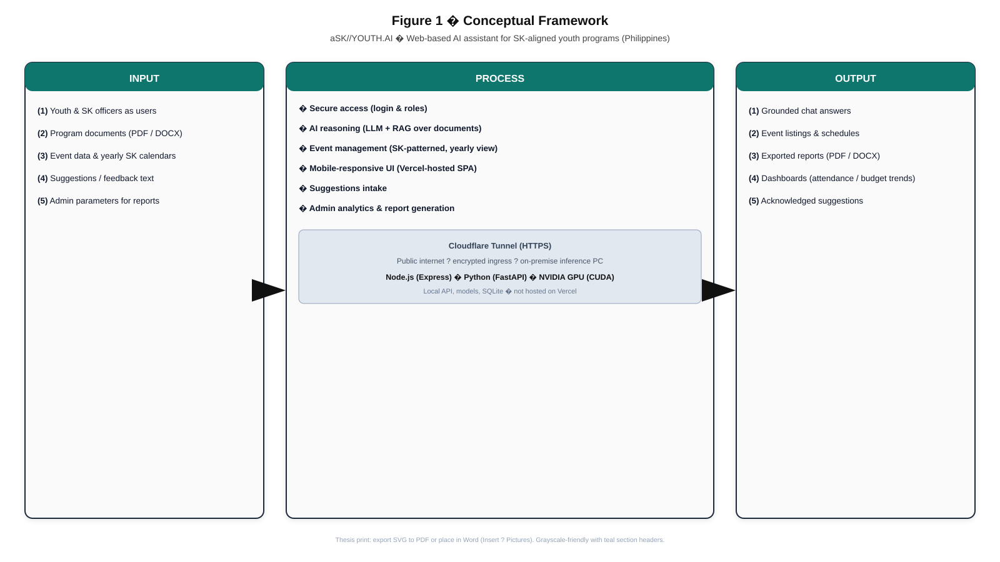

# Figure 1 — Conceptual Framework (rendered)

Vector source: **[`figure-1-conceptual-framework.svg`](./figure-1-conceptual-framework.svg)**

## Preview in VS Code / GitHub

Open the `.svg` file directly, or embed in another document:

```html

```

## Thesis / Word

1. **Insert → Pictures → This Device** and choose `figure-1-conceptual-framework.svg` (Word 365 supports SVG).  
2. Or open SVG in **Edge / Chrome → Print → Save as PDF** for a raster-free PDF page.

## Regenerate from prompt

If you need a different style, use the **Prompt** block under *Figure 1* in [`../CHAPTER_3_DIAGRAM_PROMPTS.md`](../CHAPTER_3_DIAGRAM_PROMPTS.md).
